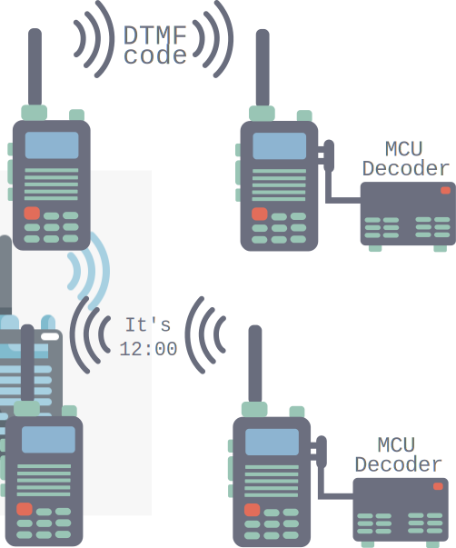

*„Wer mit der schönsten Angel zum Fischen geht, sollte sich nicht über unschönen Beifang wundern. Selbiges gilt auch für Funker.“* - M. Krause

# Introduction
This software allows remote control of an amateur radio station using [DTMF](https://en.wikipedia.org/wiki/DTMF) tones. 
A transmitting station S sends [DTMF tones](https://en.wikipedia.org/wiki/DTMF#Keypad) to a receiving station R. 
The software and hardware for controlling the receiving station is implemented in this project.

The radio of the receiving station does not need to be able to decode the DTMF tones. 
This task is performed by the external [MT8870 chip](https://archive.fo/ns0sL), which converts the analogue signals into a bit sequence and sends it to a microcontroller(MCU). 
The actual control of the receiving station is performed by an 8-bit microcontroller (e.g. 
[ATmega328](https://docs.arduino.cc/hardware/nano/) or [LGT8F328P](https://github.com/dbuezas/lgt8fx)) with a CPU clock frequency of at least 16 MHz. 
Although the control possibilities are limited only by your imagination, here is an example of a [DCF77](https://en.wikipedia.org/wiki/DCF77) time announcement via a synthetic voice output over [TMS5220](https://en.wikipedia.org/wiki/Texas_Instruments_LPC_Speech_Chips) simulation. 
In addition, various phrases, e.g. your own [callsign](https://en.wikipedia.org/wiki/Call_sign#Amateur_radio), can be called up from receiving station R for a reception test. Please also note the legal regulations for radio transmissions in your country.

To give you an idea of the project, the following figure shows a sketch.

  

A DTMF-capable radio device sends a defined DTMF string to the receiver. (left side)
The receiver radio (right) forwards the demodulated AF to the MT8870 DTMF decoder. The decoder in turn converts the DTMF AF signal into a 4-bit binary string and sends this to the microcontroller (MCU). The DTMF decoder and the MCU are summarised as the MCU decoder in the illustration. The MCU analyses the bit sequence and reacts to it. In this case with the time announcement. The MCU switches the receiver to transmit and sends a systemised voice with time announcement and call sign.

## Project status and known problems
This project is still at an early stage. Although the source code seems to work reliably and the hardware schematic is correct, there are still some organisational and stylistic things that should be improved in the source code. The biggest point is the integration of a scheduler to realise process handling 

## Hardware Setup
...

## Usage
...

## Thanks to
Peter Knight for the [Talkie Library](https://github.com/going-digital/Talkie) 
[wo4rob](http://www.wo4rob.com/DTMF-Remote-Control.html) for predefined words for synthesised speech 
Rob Tillaart for the [MT8870 Library](https://github.com/RobTillaart/MT8870) 

## Licence
This programme by Michael Krause is licensed under the GPLv3.
Please note that the authors of the libraries used may use different licences. (see links)